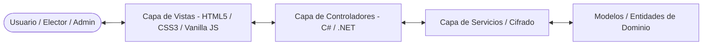
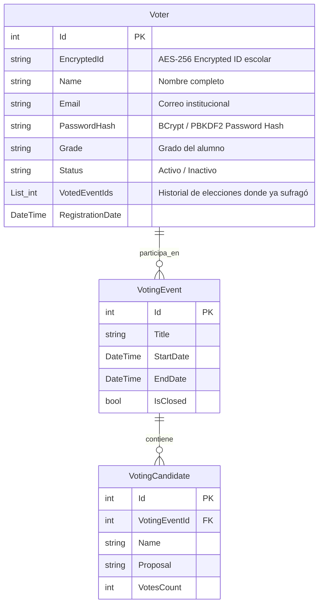
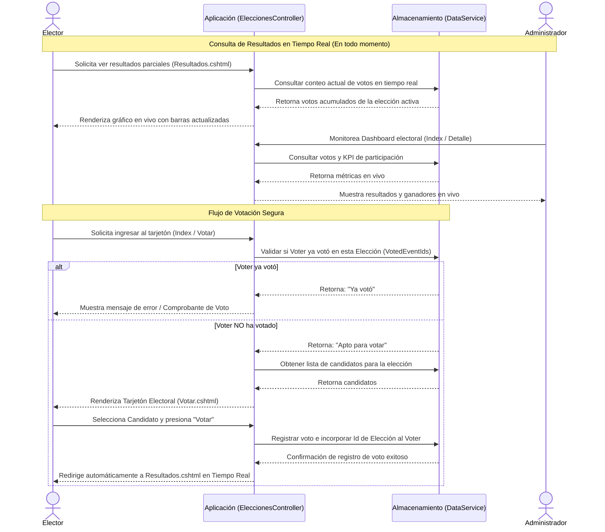

# Arquitectura y Diseño de Software
## Sistema de Votaciones Digitales (Wahl Mirai)

Este documento describe la arquitectura técnica, la estructura del proyecto en ASP.NET Core MVC, el modelo de datos y el flujo de control del sistema de elecciones **Wahl Mirai**.

---

## 1. Arquitectura del Sistema
El sistema se desarrolla utilizando el patrón de arquitectura **Model-View-Controller (MVC)** provisto por ASP.NET Core y se fundamenta en tecnologías estándares y lenguajes fuertemente definidos:



*   **Tecnologías de Frontend:**
    *   **HTML5** semántico para estructurar el contenido de forma accesible.
    *   **Vanilla CSS (CSS3)** estructurado con variables y tokens para lograr una interfaz premium y coherente con el manual de marca sin depender de frameworks CSS adicionales.
    *   **Vanilla JS** para interactividad reactiva en tiempo real (por ejemplo, recarga automática de gráficos e inputs del tarjetón).
*   **Tecnologías de Backend:**
    *   **C#** como lenguaje único de backend.
    *   **.NET (ASP.NET Core MVC)** para la lógica de servidor, enrutamiento y autenticación basada en cookies/sesiones.
*   **Servicio de Seguridad y Datos (Services):**
    *   `DataService.cs` y helper de encriptación encargado de realizar hashing de contraseñas y cifrado simétrico (AES-256) sobre datos de identidad sensibles (como la identificación única de los votantes).

---

## 2. Estructura de Directorios del Proyecto Simplificado

Tras remover los módulos no deseados, la estructura del proyecto quedará organizada de la siguiente manera:

```
Proyecto-Principal/
│
├── Controllers/
│   ├── AccountController.cs       # Control de Login, Registro y Roles
│   ├── HomeController.cs          # Redirección inicial
│   ├── VotingController.cs        # Gestión Electoral y Escrutinio en Vivo (Administrador)
│   └── EleccionesController.cs    # Interfaz de Votación y Consulta de Resultados (Elector)
│
├── Models/
│   ├── VotingEvent.cs             # Modelo para Eventos Electorales
│   ├── VotingCandidate.cs         # Modelo para Candidatos
│   ├── Voter.cs                   # Modelo completo de Elector (Votante)
│   └── ErrorViewModel.cs          # Errores globales del sistema
│
├── Services/
│   ├── DataService.cs             # Persistencia simulada y lógica de negocio
│   └── EncryptionService.cs       # Cifrado de datos sensibles (AES-256 y BCrypt)
│
├── Views/
│   ├── Account/
│   │   └── Login.cshtml           # Vista de inicio de sesión
│   ├── Home/
│   │   └── Index.cshtml           # Landing de redirección
│   ├── Voting/                    # Vistas para el Administrador
│   │   ├── Index.cshtml           # Dashboard electoral y KPIs en vivo
│   │   ├── Crear.cshtml           # Formulario para nueva elección
│   │   ├── Registro.cshtml        # Historial de elecciones
│   │   └── Detalle.cshtml         # Escrutinio y ganadores
│   ├── Elecciones/                # Vistas para el Elector
│   │   ├── Index.cshtml           # Elecciones disponibles
│   │   ├── Inscripcion.cshtml     # Postularse como candidato
│   │   ├── Votar.cshtml           # Tarjetón interactivo
│   │   └── Resultados.cshtml      # Resultados estudiantiles en tiempo real
│   └── Shared/
│       ├── _Layout.cshtml         # Estructura HTML base
│       ├── _AdminLayout.cshtml    # Menú lateral y barra superior (Admin)
│       └── _StudentLayout.cshtml  # Menú lateral y barra superior (Estudiante)
│
└── wwwroot/                       # Archivos estáticos (CSS, JS, Imágenes, Fuentes)
```

---

## 3. Modelo de Datos (Diagrama Entidad-Relación)

A continuación se detalla el modelo de datos de **Wahl Mirai**, incluyendo los campos del registro del votante y el cifrado de información:



---

## 4. Diagrama de Flujo del Proceso de Votación y Consulta en Vivo

El siguiente diagrama de secuencia detalla cómo los electores emiten su voto y cómo todos los actores visualizan los resultados en tiempo real durante la elección:


