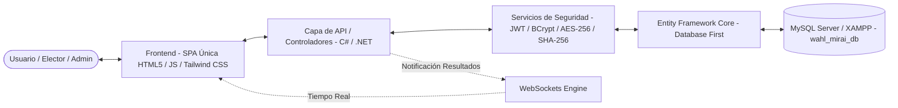
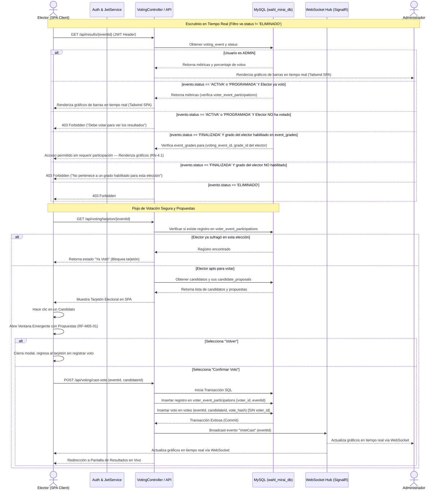

# Arquitectura y Diseño de Software
## Sistema de Votaciones Digitales (Wahl Mirai) — Versión 2.6

Este documento describe la arquitectura técnica, la estructura del proyecto en ASP.NET Core MVC / Web API + SPA, el modelo de datos relacional completo (12 tablas) y los flujos de control del sistema de elecciones **Wahl Mirai**.

---

## 1. Arquitectura del Sistema

El sistema se desarrolla utilizando una arquitectura desacoplada basada en **ASP.NET Core (MVC / Web API)** en el backend y una **Single Page Application (SPA)** única en el frontend. La persistencia y el acceso a datos se gestionan mediante **Entity Framework Core (Database First)** sobre **MySQL**:



*   **Tecnologías de Frontend:**
    *   **HTML5** semántico para una estructura accesible y estándar.
    *   **Tailwind CSS** para un diseño moderno, reactivo, responsivo y consistente con el manual de marca, utilizando utilidades atómicas de alta fidelidad estética sin depender de plantillas pesadas.
    *   **Vanilla JS (ES6+)** para la lógica de cliente de la SPA única, consumo de endpoints REST/JSON y comunicación bidireccional en tiempo real mediante **WebSockets**.
*   **Tecnologías de Backend:**
    *   **C#** como lenguaje único de servidor sobre **.NET 9.0 / ASP.NET Core**.
    *   **Autenticación JWT (JSON Web Token):** Manejo de sesiones sin estado (stateless) mediante tokens firmados enviados en el encabezado `Authorization: Bearer <token>`, conteniendo los claims de identidad y rol (`ADMIN` o `ELECTOR`).
    *   **Entity Framework Core (Database First):** Mapeo objeto-relacional (ORM) mediante el proveedor **Pomelo.EntityFrameworkCore.MySql** sobre MySQL (XAMPP).
*   **Servicio de Seguridad y Cifrado (`EncryptionService` & `AuthService`):**
    *   **Hashing de contraseñas:** Implementado mediante **BCrypt** con factor de trabajo adecuado.
    *   **Hash determinístico de documento (`document_hash`):** Generado mediante **SHA-256** expresado en un string hexadecimal de exactamente 64 caracteres (`CHAR(64)` en MySQL). Se utiliza para indexación única y búsquedas de inicio de sesión sin exponer el documento plano.
    *   **Cifrado reversible de documento (`encrypted_document`):** Cifrado simétrico **AES-256** (`VARCHAR(500)`) para almacenamiento seguro del documento de identidad y su posterior desencriptación en paneles administrativos autorizados.
    *   **Gestión de Claves:** Autogeneración aleatoria de contraseñas por el sistema para nuevos electores y restablecimientos (RN-2, RN-2.1). **Se elimina el flujo de cambio obligatorio de contraseña en el primer login**.

---

## 2. Estructura de Directorios del Proyecto

La estructura del proyecto ASP.NET Core desacoplada para la arquitectura SPA + Web API se organiza de la siguiente manera:

```
WahlMirai.Web/
│
├── Controllers/
│   ├── AuthController.cs          # Autenticación JWT, Login por documento y Recuperación (M01)
│   ├── CensusController.cs        # Gestión del Censo, Carga CSV, Promoción y Reasignación (M02)
│   ├── ElectionsController.cs     # CRUD de Elecciones y Soft-Delete (M03)
│   ├── CandidatesController.cs    # Inscripción de Candidatos y Propuestas (M04)
│   ├── VotingController.cs        # Emisión de Voto, Verificación Anti-Duplicado (M05)
│   ├── ResultsController.cs       # Escrutinio en Vivo, WebSocket Hub y Consulta (M06)
│   └── ProfileController.cs       # Autogestión de Perfil Propio (M07)
│
├── Models/
│   ├── Entities/                  # Entidades autogeneradas por EF Core (Database First)
│   │   ├── Role.cs
│   │   ├── AcademicYear.cs
│   │   ├── Grade.cs
│   │   ├── Voter.cs
│   │   ├── EmailQueue.cs
│   │   ├── VotingEvent.cs
│   │   ├── EventGrade.cs
│   │   ├── Candidate.cs
│   │   ├── CandidateProposal.cs
│   │   ├── Vote.cs
│   │   ├── VoterEventParticipation.cs
│   │   └── AuditLog.cs
│   └── DTOs/                      # Data Transfer Objects para requests y responses JSON
│       ├── LoginRequestDto.cs
│       ├── VoterCreateDto.cs
│       ├── VoteSubmissionDto.cs
│       └── ProfileUpdateDto.cs
│
├── Data/
│   └── WahlMiraiDbContext.cs      # DbContext configurado con Pomelo MySQL
│
├── Services/
│   ├── EncryptionService.cs       # Algoritmos SHA-256, AES-256 y BCrypt
│   ├── JwtService.cs              # Generación y validación de JSON Web Tokens
│   ├── EmailQueueService.cs       # Worker background para consumo progresivo de email_queue (RN-9)
│   └── AuditService.cs            # Registro centralizado en audit_log (RN-8)
│
├── Hubs/
│   └── ElectionResultsHub.cs      # SignalR / WebSocket Hub para transmisión de escrutinio en tiempo real
│
└── wwwroot/                       # SPA Única Client-Side
    ├── index.html                 # Punto de entrada de la SPA
    ├── css/
    │   └── tailwind.css           # Estilos procesados con Tailwind CSS
    └── js/
        ├── app.js                 # Enrutador cliente y estado global de la SPA
        ├── components/            # Módulos JS (Tarjetón, Modales, Dashboard, Escrutinio)
        └── services/              # Cliente HTTP REST (Fetch + JWT Headers) y WebSocket Client
```

---

## 3. Modelo de Datos (Diagrama Entidad-Relación — 12 Tablas)

El modelo de base de datos de **Wahl Mirai v2.6** contempla 12 tablas organizadas relacionalmente, garantizando el anonimato del voto (RN-3), el censo persistente (RN-6), la auditoría (RN-8), el envío progresivo de correos (RN-9) y el soft-delete de procesos (RN-7.1):

```mermaid
erDiagram
    roles ||--o{ voters : "asigna_rol"
    grades ||--o{ voters : "pertenece_a_grado"
    grades ||--o{ event_grades : "habilitado_en"
    voting_events ||--o{ event_grades : "clasifica"
    voters ||--o{ email_queue : "receptores_cola"
    voters ||--o{ voting_events : "creado_por"
    voting_events ||--o{ candidates : "postula"
    voters ||--o? candidates : "es_candidato"
    candidates ||--o{ candidate_proposals : "posee_propuestas"
    voting_events ||--o{ votes : "recibe_votos"
    candidates ||--o{ votes : "acumula_votos"
    voters ||--o{ voter_event_participations : "registra_participacion"
    voting_events ||--o{ voter_event_participations : "rastrea_emision"
    voters ||--o? audit_log : "ejecuta_accion"

    roles {
        TINYINT id PK
        VARCHAR_30 name
        VARCHAR_100 description
    }

    academic_years {
        SMALLINT id PK
        SMALLINT year
        TINYINT_1 is_current
        DATETIME promotion_executed_at
    }

    grades {
        TINYINT id PK
        VARCHAR_10 name
        TINYINT sequence_order
        TINYINT_1 is_last_grade
    }

    voters {
        INT id PK
        TINYINT role_id FK
        TINYINT grade_id FK
        CHAR_64 document_hash UK
        VARCHAR_500 encrypted_document
        VARCHAR_150 full_name
        VARCHAR_150 contact_email
        VARCHAR_255 password_hash
        TINYINT_1 excluir_de_promocion
        ENUM status "ACTIVO, INACTIVO, ELIMINADO, EGRESADO"
        DATETIME deleted_at
    }

    email_queue {
        BIGINT id PK
        INT voter_id FK
        ENUM email_type "CREDENCIAL_INICIAL, RECUPERACION_ACCESO, REASIGNACION_ADMIN, CAMBIO_PERFIL"
        ENUM status "PENDIENTE, ENVIADO, FALLIDO"
        TINYINT attempts
        TEXT error_message
    }

    voting_events {
        INT id PK
        INT created_by_voter_id FK
        VARCHAR_200 title
        ENUM election_type "PERSONAS, TEMAS"
        DATE start_date
        TIME start_time
        DATE end_date
        TIME end_time
        ENUM status "PROGRAMADA, ACTIVA, FINALIZADA, ELIMINADO"
        DATETIME deleted_at
    }

    event_grades {
        INT id PK
        INT voting_event_id FK
        TINYINT grade_id FK
    }

    candidates {
        INT id PK
        INT voting_event_id FK
        INT voter_id FK "Nullable si es voto en blanco"
        VARCHAR_150 name
        TEXT slogan
        VARCHAR_500 photo_url
        TINYINT_1 is_blank_vote
        ENUM status "PENDIENTE, APROBADO, RECHAZADO"
    }

    candidate_proposals {
        INT id PK
        INT candidate_id FK
        TEXT content
        TINYINT display_order
    }

    votes {
        BIGINT id PK
        INT voting_event_id FK
        INT candidate_id FK
        VARCHAR_64 vote_hash UK "SHA-256 criptografico"
        DATETIME voted_at
    }

    voter_event_participations {
        INT id PK
        INT voter_id FK
        INT voting_event_id FK
        DATETIME participated_at
    }

    audit_log {
        BIGINT id PK
        INT voter_id FK "Nullable si fue el sistema"
        VARCHAR_100 action
        VARCHAR_200 target_entity
        INT target_id
        VARCHAR_100 field_name
        TEXT old_value
        TEXT new_value
        TEXT details
    }
```

---

## 4. Diagrama de Flujo del Proceso de Votación y Escrutinio

El diagrama de secuencia describe el flujo completo de sufragio con **ventana emergente obligatoria de propuestas**, control anti-duplicado mediante `voter_event_participations`, **anonimización absoluta** en la tabla `votes` y transmisión en tiempo real por **WebSockets**:



---

## 5. Descripción de Módulos y Reglas de Negocio

### 5.1 M01 — Gestión de Acceso y Sesión
*   **RF-M01-01 (Autenticación por Documento):** Login mediante `document_hash` (SHA-256 en string hexadecimal de exactamente 64 caracteres) y `password_hash` (BCrypt). Emisión de JWT.
*   **RF-M01-02 (Recuperación de Acceso):** Solicita el documento. Si existe, genera una nueva clave aleatoria, actualiza el hash BCrypt y registra un item en `email_queue` (`email_type = 'RECUPERACION_ACCESO'`). No revela la existencia del usuario si falla.

### 5.2 M02 — Gestión del Censo Electoral (Exclusivo Administrador)
*   **RF-M02-01 (Carga del Censo):** Registro individual o masivo (CSV). Requiere `contact_email` obligatorio (RN-2.1). Genera clave aleatoria y encola correos en `email_queue` (`email_type = 'CREDENCIAL_INICIAL'`) (RN-9).
*   **RF-M02-02 (Edición y Soft-Delete de Electores):** Modificación de datos y eliminación lógica cambiando `voters.status = 'ELIMINADO'` y registrando `deleted_at`. Los votos emitidos previamente son inmutables (RN-7). Auditoría en `audit_log` (RN-8).
*   **RF-M02-03 (Promoción Automática Anual):** Avanza masivamente el grado de electores activos según `grades.sequence_order`. Los electores en el último grado (`is_last_grade = 1`) pasan a estado `EGRESADO`. No maneja salones/paralelos (RN-6). Se controla vía `academic_years.promotion_executed_at`.

### 5.3 M03 — Gestión de Elecciones
*   **RF-M03-01 (Parametrización):** Configuración de Título, Tipo (`PERSONAS` o `TEMAS`), límites de fecha/hora y grados asignados en `event_grades`.
*   **RF-M03-02 & RN-7.1 (Soft-Delete de Procesos Electorales):** Eliminación lógica marcando `voting_events.status = 'ELIMINADO'` y registrando `deleted_at`. El proceso se oculta e inhabilita para electores, pero sus candidatos, propuestas y votos en la tabla `votes` permanecen intactos e inmutables para fines de auditoría histórica.

### 5.4 M04 — Candidatos y Propuestas
*   **RF-M04-01 (Inscripción de Candidatos y Propuestas):** Asignación de candidatos por elección (incluyendo Voto en Blanco por defecto). Registro de las propuestas individuales en la tabla `candidate_proposals` (`display_order`, `content`).

### 5.5 M05 — Proceso de Votación y Control de Voto Único
*   **RF-M05-01 (Emisión de Voto y Anonimato):** Ventana emergente obligatoria con las propuestas del candidato antes de la confirmación. La tabla `votes` no guarda ninguna referencia al elector (RN-3), garantizando secreto absoluto. El control anti-duplicado se realiza verificando e insertando la tupla `(voter_id, voting_event_id)` en `voter_event_participations`.

### 5.6 M06 — Escrutinio y Resultados en Tiempo Real
*   **RF-M06-01 (Resultados Condicionados — RN-4 / RN-4.1 / RN-5):** El acceso a las métricas en vivo se rige por tres condiciones excluyentes evaluadas en `ResultsController`:
    1. **Administrador (RN-5):** Acceso irrestricto en cualquier estado del evento, sin verificaciones adicionales.
    2. **Elector — elección `ACTIVA` o `PROGRAMADA` (RN-4):** Se verifica la existencia de un registro `(voter_id, voting_event_id)` en `voter_event_participations`. Si no existe, se retorna **403 Forbidden** con el mensaje 'Debe votar para ver los resultados'.
    3. **Elector — elección `FINALIZADA` (RN-4.1):** Se verifica que el `grade_id` del elector (tabla `voters`) esté registrado en `event_grades` para ese `voting_event_id`. Si el grado pertenece, el acceso se concede sin importar si el elector votó. Si el grado no pertenece, se retorna **403 Forbidden** con el mensaje 'No pertenece a un grado habilitado para esta elección'. Si el estado es `ELIMINADO`, se deniega siempre a los electores.
    Transmisión vía WebSockets (SignalR). La vista `vw_vote_counts` filtra explícitamente procesos en estado `ELIMINADO` (`WHERE ve.status != 'ELIMINADO'`) y no requiere modificación para esta nueva regla.

### 5.7 M07 — Perfil de Usuario y Autogestión de Credenciales
*   **RF-M07-01 (Consulta y Edición de Perfil Propio):** Todo usuario autenticado puede consultar sus datos y modificar su `contact_email` o su contraseña. La actualización del correo de contacto es directa desde la vista principal del perfil, mientras que el cambio de contraseña se gestiona mediante un modal flotante interactivo en 2 pasos (Paso 1: verificación asíncrona AJAX de la contraseña actual; Paso 2: nueva contraseña con lista de verificación en tiempo real de reglas de complejidad: mínimo 8 caracteres, al menos 1 letra mayúscula y al menos 1 símbolo especial). Se asienta el evento en `audit_log` e inserta la notificación en `email_queue`. Los datos del censo (documento, nombre, grado) permanecen en modo lectura.
*   **RF-M07-02 (Reasignación de Contraseña por el Administrador):** El Administrador puede forzar la generación de una nueva contraseña aleatoria para cualquier elector desde el censo. Se encola la notificación en `email_queue` (`email_type = 'REASIGNACION_ADMIN'`) y se registra en `audit_log`.

### 5.8 Servicio de Cola de Envío Progresivo (RN-9)
*   **Funcionamiento:** Las operaciones masivas o individuales no realizan envíos SMTP síncronos. Insertan registros en `email_queue`. Un servicio en segundo plano (`EmailQueueService`) consume los elementos `PENDIENTE` aplicando control de tasa (por ejemplo, máx N correos por minuto) para evitar bloqueos por parte del proveedor institucional.
