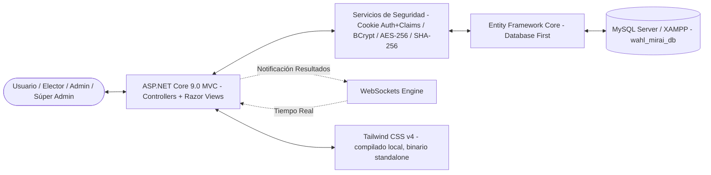
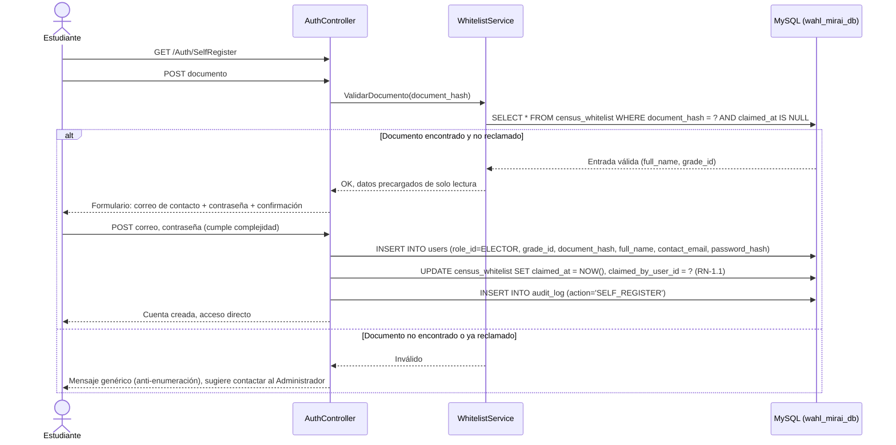
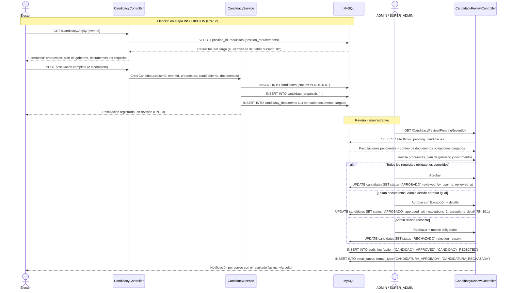
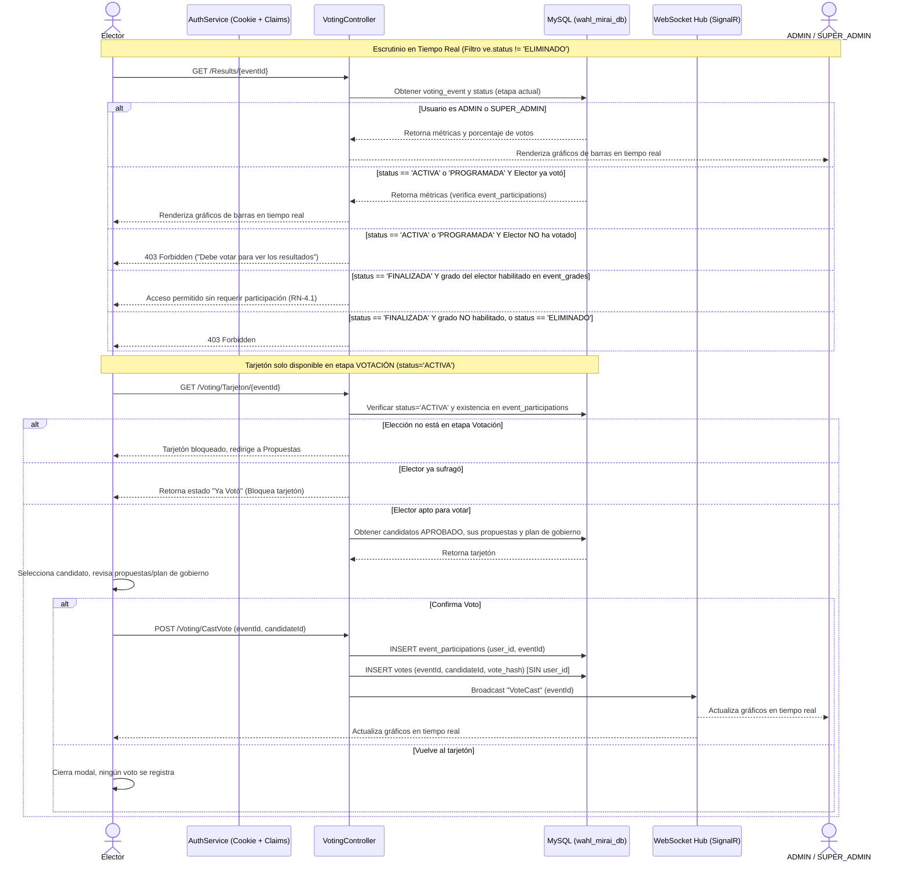

# Arquitectura y Diseño de Software
## Sistema de Votaciones Digitales (Wahl Mirai) — Versión 2.8

Este documento describe la arquitectura técnica, la estructura del proyecto en **ASP.NET Core 9.0 MVC** (Razor Views), el modelo de datos relacional completo (17 tablas) y los flujos de control del sistema de elecciones **Wahl Mirai**, alineado con **ERS v2.8**.

> **Nota de corrección respecto a v2.7:** la versión anterior de este documento describía autenticación mediante **JWT**. Esa referencia nunca correspondió a la implementación real del proyecto, que usa **Cookie Authentication con Claims** (`Microsoft.AspNetCore.Authentication.Cookies`) desde el inicio. Se corrige en esta versión para que el documento refleje el stack real.

---

## 1. Arquitectura del Sistema

El sistema se desarrolla como una aplicación **ASP.NET Core 9.0 MVC** con **Razor Views** renderizadas en servidor (no SPA), con capas administrativa y de elector diferenciadas mediante layouts dinámicos (`_AdminLayout` / `_ElectorLayout`). La persistencia y el acceso a datos se gestionan mediante **Entity Framework Core (Database First)** con **Pomelo.EntityFrameworkCore.MySql** sobre **MySQL/XAMPP**:



* **Tecnologías de Frontend:**
  * **Razor Views** semánticas y accesibles, renderizadas en servidor.
  * **Tailwind CSS v4**, compilado localmente vía binario standalone (`tailwindcss.exe`, auto-descargado por MSBuild), con sistema de tokens semánticos propio (`--color-status-*`) en lugar de utilidades de color estándar.
  * **Vanilla JS (ES6+)** para interacciones puntuales (acordeón de Ayuda, chatbot por reglas, modal de cambio de contraseña, filtros de PQR) y comunicación en tiempo real vía **WebSockets**.
* **Tecnologías de Backend:**
  * **C#** sobre **.NET 9.0 / ASP.NET Core MVC**.
  * **Cookie Authentication con Claims:** manejo de sesión mediante cookie de autenticación firmada, con claims de identidad y rol (`ELECTOR`, `ADMIN`, `SUPER_ADMIN`). Las vistas y controladores usan `[Authorize(Roles = "...")]` y `User.IsInRole(...)` para autorización.
  * **Entity Framework Core (Database First):** ORM mediante **Pomelo.EntityFrameworkCore.MySql**.
* **Servicio de Seguridad y Cifrado (`EncryptionService` & `AuthService`):**
  * **Hashing de contraseñas:** **BCrypt** con factor de trabajo adecuado; se aplica tanto a la contraseña que el propio elector define en su auto-registro (RF-M01-00) como a la generada aleatoriamente en recuperación (RF-M01-02) y reasignación (RF-M07-02).
  * **Hash determinístico de documento (`document_hash`):** **SHA-256**, `CHAR(64)`, usado tanto para validar contra `census_whitelist` durante el auto-registro como para el login en `users`.
  * **Cifrado reversible de documento (`encrypted_document`):** **AES-256** (`VARCHAR(500)`) vía ASP.NET Core Data Protection API, presente tanto en `census_whitelist` como en `users`.
  * **Gestión de Claves:** las claves de Data Protection son locales a cada máquina de desarrollo; nunca se comparten en el repositorio ni se versionan valores ya cifrados en los scripts SQL semilla.

---

## 2. Estructura de Directorios del Proyecto

```
WahlMirai.Web/
│
├── Controllers/
│   ├── AuthController.cs           # Login, Auto-registro (RF-M01-00) y Recuperación (M01)
│   ├── CensusController.cs         # Carga/gestión de Lista Blanca, censo activo, promoción (M02)
│   ├── PositionsController.cs      # Catálogo de Cargos Electorales y sus requisitos (RF-M03-00)
│   ├── ElectionsController.cs      # CRUD de Elecciones por etapas y Soft-Delete (M03)
│   ├── CandidacyController.cs      # Autopostulación, documentos y plan de gobierno (RF-M04-01)
│   ├── CandidacyReviewController.cs # Aprobación / rechazo de candidaturas (RF-M04-02)
│   ├── VotingController.cs         # Emisión de Voto, Verificación Anti-Duplicado (M05)
│   ├── ResultsController.cs        # Escrutinio en Vivo, WebSocket Hub y Consulta (M06)
│   ├── ProfileController.cs        # Autogestión de Perfil Propio (M07)
│   ├── PqrController.cs            # Creación y Gestión de PQR (M08)
│   └── AdminAccountsController.cs  # Gestión de cuentas ADMIN/SUPER_ADMIN (M09, exclusivo Súper Admin)
│
├── Models/
│   ├── Entities/                   # Entidades autogeneradas por EF Core (Database First)
│   │   ├── Role.cs
│   │   ├── AcademicYear.cs
│   │   ├── Grade.cs
│   │   ├── CensusWhitelist.cs       # NUEVA
│   │   ├── User.cs                  # RENOMBRADA (antes Voter.cs)
│   │   ├── EmailQueue.cs
│   │   ├── ElectionPosition.cs      # NUEVA
│   │   ├── PositionRequirement.cs   # NUEVA
│   │   ├── VotingEvent.cs
│   │   ├── EventGrade.cs
│   │   ├── Candidate.cs
│   │   ├── CandidateProposal.cs
│   │   ├── CandidacyDocument.cs     # NUEVA
│   │   ├── Vote.cs
│   │   ├── EventParticipation.cs    # RENOMBRADA (antes VoterEventParticipation.cs)
│   │   ├── AuditLog.cs
│   │   └── PqrTicket.cs
│   └── DTOs/                       # Data Transfer Objects para requests y responses
│       ├── LoginRequestDto.cs
│       ├── SelfRegisterRequestDto.cs    # NUEVA — RF-M01-00
│       ├── WhitelistUploadDto.cs        # NUEVA — RF-M02-00
│       ├── ElectionCreateDto.cs         # actualizado: 3 ventanas de etapa + position_id
│       ├── CandidacyCreateDto.cs        # NUEVA — RF-M04-01
│       ├── CandidacyReviewDto.cs        # NUEVA — RF-M04-02 (aprobar / aprobar con excepción / rechazar)
│       ├── VoteSubmissionDto.cs
│       ├── ProfileUpdateDto.cs
│       ├── PqrCreateDto.cs
│       ├── PqrResponseDto.cs
│       └── AdminAccountCreateDto.cs     # NUEVA — RF-M09-01
│
├── Data/
│   └── WahlMiraiDbContext.cs       # DbContext configurado con Pomelo MySQL (DbSet<User> reemplaza DbSet<Voter>)
│
├── Services/
│   ├── EncryptionService.cs        # Algoritmos SHA-256, AES-256 y BCrypt
│   ├── AuthService.cs              # Cookie Authentication + Claims: login, auto-registro, recuperación
│   ├── WhitelistService.cs         # NUEVO — validación y carga de census_whitelist (RF-M02-00, RF-M01-00)
│   ├── CandidacyService.cs         # NUEVO — autopostulación, validación de requisitos, aprobación/rechazo
│   ├── ElectionStageService.cs     # NUEVO — cálculo/transición automática de etapas (RN-12)
│   ├── EmailQueueService.cs        # Worker background para consumo progresivo de email_queue (RN-9)
│   └── AuditService.cs             # Registro centralizado en audit_log (RN-8)
│
├── Hubs/
│   └── ElectionResultsHub.cs       # SignalR / WebSocket Hub para transmisión de escrutinio en tiempo real
│
├── Views/
│   ├── Auth/                       # Login.cshtml, SelfRegister.cshtml, Recover.cshtml
│   ├── Census/                     # Whitelist.cshtml, ActiveCensus.cshtml
│   ├── Positions/                  # Index.cshtml, Requirements.cshtml
│   ├── Elections/                  # Index.cshtml, Create.cshtml (3 bloques de fecha/hora), Edit.cshtml
│   ├── Candidacy/                  # Apply.cshtml (autopostulación), Review.cshtml (aprobación admin)
│   ├── Voting/
│   ├── Results/
│   ├── Profile/
│   ├── Pqr/                        # Index.cshtml (Ayuda + historial + chatbot), Manage.cshtml
│   └── AdminAccounts/              # Index.cshtml, Create.cshtml (exclusivo SUPER_ADMIN)
│
└── wwwroot/
    ├── css/
    │   └── tailwind.css            # Estilos procesados con Tailwind CSS v4
    ├── img/
    │   └── ayuda/                  # Ilustraciones SVG estáticas por tema (M08, RF-M08-00)
    │       ├── ayuda-registro.svg       # Consolidación del nombre planificado (ayuda-autoregistro.svg nunca se implementó en disco)
    │       ├── ayuda-login.svg
    │       ├── ayuda-recuperar.svg
    │       ├── ayuda-postulacion.svg
    │       ├── ayuda-votar.svg
    │       ├── ayuda-perfil.svg
    │       └── ayuda-resultados.svg
    └── js/
        ├── pqr-manage.js            # Panel de gestión de PQR (M08, ya implementado)
        ├── ayuda-chatbot.js         # NUEVO — motor de reglas por palabras clave/menú (RF-M08-03)
        ├── candidacy-apply.js       # NUEVO — carga de documentos y plan de gobierno (RF-M04-01)
        └── services/                # Cliente WebSocket para resultados en tiempo real
```

---

## 3. Modelo de Datos (Diagrama Entidad-Relación — 17 Tablas)

El modelo de base de datos de **Wahl Mirai v2.8** contempla 17 tablas. Respecto a v2.7 se agregan `census_whitelist`, `election_positions`, `position_requirements` y `candidacy_documents`; `voters` se renombra a `users`; `voter_event_participations` se renombra a `event_participations`:

```mermaid
erDiagram
    roles ||--o{ users : "asigna_rol"
    grades ||--o{ users : "pertenece_a_grado"
    grades ||--o{ census_whitelist : "pertenece_a_grado"
    users ||--o{ census_whitelist : "carga_lista_blanca"
    users ||--o? census_whitelist : "reclama_registro"
    grades ||--o{ event_grades : "habilitado_en"
    election_positions ||--o{ position_requirements : "define_requisitos"
    election_positions ||--o{ voting_events : "clasifica_cargo"
    voting_events ||--o{ event_grades : "clasifica_grados"
    users ||--o{ email_queue : "receptores_cola"
    users ||--o{ voting_events : "creado_por"
    voting_events ||--o{ candidates : "recibe_postulaciones"
    users ||--o? candidates : "se_autopostula"
    users ||--o{ candidates : "revisa_candidatura"
    candidates ||--o{ candidate_proposals : "posee_propuestas"
    candidates ||--o{ candidacy_documents : "adjunta_soportes"
    position_requirements ||--o{ candidacy_documents : "exige_soporte"
    voting_events ||--o{ votes : "recibe_votos"
    candidates ||--o{ votes : "acumula_votos"
    users ||--o{ event_participations : "registra_participacion"
    voting_events ||--o{ event_participations : "rastrea_emision"
    users ||--o{ audit_log : "ejecuta_accion"
    users ||--o{ pqr_tickets : "crea_ticket"
    users ||--o? pqr_tickets : "resuelve_ticket"

    roles {
        TINYINT id PK
        VARCHAR_30 name "ELECTOR, ADMIN, SUPER_ADMIN"
        VARCHAR_100 description
    }

    academic_years {
        SMALLINT id PK
        SMALLINT year
        TINYINT_1 is_current
        DATETIME promotion_executed_at
    }

    grades {
        TINYINT id PK
        VARCHAR_10 name
        TINYINT sequence_order
        TINYINT_1 is_last_grade
    }

    census_whitelist {
        INT id PK
        CHAR_64 document_hash UK
        VARCHAR_500 encrypted_document
        VARCHAR_150 full_name
        TINYINT grade_id FK
        TINYINT_1 excluir_de_promocion
        DATETIME claimed_at "NULL = no reclamado"
        INT claimed_by_user_id FK "Nullable"
        INT uploaded_by_user_id FK
    }

    users {
        INT id PK
        TINYINT role_id FK
        TINYINT grade_id FK "NULL para cuentas administrativas"
        CHAR_64 document_hash UK
        VARCHAR_500 encrypted_document
        VARCHAR_150 full_name
        VARCHAR_150 contact_email
        VARCHAR_255 password_hash
        VARCHAR_100 position_title "Solo ADMIN/SUPER_ADMIN, texto libre"
        TINYINT_1 excluir_de_promocion
        ENUM status "ACTIVO, INACTIVO, ELIMINADO, EGRESADO"
        DATETIME deleted_at
    }

    email_queue {
        BIGINT id PK
        INT user_id FK
        ENUM email_type "RECUPERACION_ACCESO, REASIGNACION_ADMIN, CAMBIO_PERFIL, RESPUESTA_PQR, CANDIDATURA_APROBADA, CANDIDATURA_RECHAZADA"
        ENUM status "PENDIENTE, ENVIADO, FALLIDO"
        TINYINT attempts
        TEXT error_message
    }

    election_positions {
        INT id PK
        VARCHAR_100 name "Personero, Contralor, Representante..."
        TEXT description
        ENUM status "ACTIVO, INACTIVO"
    }

    position_requirements {
        INT id PK
        INT position_id FK
        VARCHAR_255 description
        TINYINT_1 is_mandatory
        TINYINT display_order
    }

    voting_events {
        INT id PK
        INT created_by_user_id FK
        INT position_id FK
        VARCHAR_200 title
        ENUM election_type "PERSONAS, TEMAS"
        DATE registration_start_date
        TIME registration_start_time
        DATE registration_end_date
        TIME registration_end_time
        DATE proposals_start_date
        TIME proposals_start_time
        DATE proposals_end_date
        TIME proposals_end_time
        DATE voting_start_date
        TIME voting_start_time
        DATE voting_end_date
        TIME voting_end_time
        ENUM status "PROGRAMADA, INSCRIPCION, PROPUESTAS, ACTIVA, FINALIZADA, ELIMINADO"
        DATETIME deleted_at
    }

    event_grades {
        INT id PK
        INT voting_event_id FK
        TINYINT grade_id FK
    }

    candidates {
        INT id PK
        INT voting_event_id FK
        INT user_id FK "Nullable si es voto en blanco"
        VARCHAR_150 name
        TEXT slogan
        VARCHAR_500 photo_url
        VARCHAR_500 government_plan_url
        TINYINT_1 is_blank_vote
        ENUM status "PENDIENTE, APROBADO, RECHAZADO"
        TINYINT_1 approved_with_exceptions
        TEXT exceptions_detail
        TEXT rejection_reason
        INT reviewed_by_user_id FK "Nullable"
        DATETIME reviewed_at
    }

    candidate_proposals {
        INT id PK
        INT candidate_id FK
        TEXT content
        TINYINT display_order
    }

    candidacy_documents {
        INT id PK
        INT candidate_id FK
        INT requirement_id FK
        VARCHAR_500 file_url
        DATETIME uploaded_at
    }

    votes {
        BIGINT id PK
        INT voting_event_id FK
        INT candidate_id FK
        VARCHAR_64 vote_hash UK "SHA-256 criptografico"
        DATETIME voted_at
    }

    event_participations {
        INT id PK
        INT user_id FK
        INT voting_event_id FK
        DATETIME participated_at
    }

    audit_log {
        BIGINT id PK
        INT user_id FK "Nullable si fue el sistema"
        VARCHAR_100 action
        VARCHAR_200 target_entity
        INT target_id
        VARCHAR_100 field_name
        TEXT old_value
        TEXT new_value
        TEXT details
    }

    pqr_tickets {
        BIGINT id PK
        INT user_id FK
        VARCHAR_200 subject
        TEXT message
        ENUM status "ABIERTO, RESUELTO"
        TEXT admin_response
        INT responded_by_user_id FK "Nullable"
        DATETIME responded_at
    }
```

---

## 4. Diagramas de Flujo

### 4.1 Auto-registro del Elector (RF-M01-00)



### 4.2 Autopostulación y Aprobación de Candidatura (RF-M04-01, RF-M04-02)



### 4.3 Proceso de Votación y Escrutinio (por Etapas)



---

## 5. Descripción de Módulos y Reglas de Negocio

### 5.1 M01 — Gestión de Acceso, Auto-registro y Sesión
* **RF-M01-00 (Auto-registro):** `AuthController` + `WhitelistService` validan el documento contra `census_whitelist`; si es válido y no reclamado, el elector define su propio `contact_email` y `password_hash` (BCrypt). La entrada de la lista blanca queda marcada como reclamada (RN-1.1).
* **RF-M01-01 (Autenticación):** Login mediante `document_hash` (SHA-256) y `password_hash` (BCrypt). Emisión de cookie de autenticación con claims de identidad y rol.
* **RF-M01-02 (Recuperación de Acceso):** Genera clave aleatoria, actualiza el hash BCrypt y encola `email_queue` (`email_type = 'RECUPERACION_ACCESO'`).

### 5.2 M02 — Gestión del Censo Electoral (Exclusivo Administrador)
* **RF-M02-00 (Carga de Lista Blanca):** Registro individual o masivo (CSV) en `census_whitelist` (documento, nombre, grado). Ya no genera contraseñas ni envía correos: solo autoriza el auto-registro posterior.
* **RF-M02-01 (Edición y Soft-Delete de Usuarios):** Modificación y eliminación lógica sobre `users.status = 'ELIMINADO'` con `deleted_at`. Auditoría en `audit_log` (RN-8).
* **RF-M02-02 (Promoción Automática Anual):** Avanza el grado tanto de `users` activos como de entradas no reclamadas en `census_whitelist`, según `grades.sequence_order`.

### 5.3 M03 — Gestión de Elecciones, Cargos y Etapas
* **RF-M03-00 (Catálogo de Cargos):** `PositionsController` administra `election_positions` y `position_requirements`, reutilizables entre distintas elecciones.
* **RF-M03-01 (Parametrización por Etapas):** `ElectionsController` configura `position_id` y las tres ventanas de fecha/hora (`registration_*`, `proposals_*`, `voting_*`). `ElectionStageService` corre la transición automática de `status` (RN-12).
* **RF-M03-02 (Soft-Delete de Procesos):** Igual que v2.7, marcando `status = 'ELIMINADO'` y `deleted_at`.

### 5.4 M04 — Autopostulación y Aprobación de Candidatos
* **RF-M04-01 (Autopostulación):** `CandidacyController` + `CandidacyService` permiten al propio elector crear su registro en `candidates` (`status='PENDIENTE'`), sus `candidate_proposals`, su `government_plan_url` y sus `candidacy_documents`, disponible solo durante `status='INSCRIPCION'` de la elección.
* **RF-M04-02 (Aprobación/Rechazo):** `CandidacyReviewController` consulta `vw_pending_candidacies`, y permite aprobar, aprobar con excepción (`approved_with_exceptions=1` + `exceptions_detail`) o rechazar (`rejection_reason` obligatorio). Encola `email_queue` (`CANDIDATURA_APROBADA` / `CANDIDATURA_RECHAZADA`) y registra en `audit_log`.

### 5.5 M05 — Proceso de Votación y Control de Voto Único
* **RF-M05-01:** Igual lógica de anonimato de v2.7 (`votes` sin `user_id`), ahora condicionada además a que la elección esté en `status='ACTIVA'` (etapa Votación) y a que el candidato esté `APROBADO`.

### 5.6 M06 — Escrutinio y Resultados en Tiempo Real
* **RF-M06-01 (Resultados Condicionados — RN-4 / RN-4.1 / RN-5):** Sin cambios de lógica respecto a v2.7; `ADMIN` y `SUPER_ADMIN` comparten el mismo acceso irrestricto (RN-5). `vw_vote_counts` se mantiene igual, solo actualizando el alias de columnas por el rename de tablas.

### 5.7 M07 — Perfil de Usuario y Autogestión de Credenciales
* **RF-M07-01:** Igual flujo de modal de 2 pasos que v2.7. Para cuentas `ADMIN`/`SUPER_ADMIN`, el campo `position_title` se muestra en modo lectura (solo editable por `SUPER_ADMIN` vía M09).
* **RF-M07-02 (Reasignación por Administrador):** Sin cambios de lógica; disponible tanto para `ADMIN` como `SUPER_ADMIN`.

### 5.8 M08 — Ayuda, Tutorial, PQR y Chatbot
* **RF-M08-00:** La sección de Ayuda es de acceso público (disponible para cualquier usuario, incluidos visitantes no autenticados en `/Ayuda` o `/Pqr`), mientras que la radicación y consulta de PQR (**RF-M08-01**) se mantienen estrictamente protegidas bajo autenticación. Se renombra `voter_id` a `user_id` en las consultas de historial (`GET /Pqr/Mine`).
* **RF-M08-03 (Chatbot de Ayuda):** `ayuda-chatbot.js` implementa un motor de reglas 100% cliente (palabras clave → respuesta predefinida, sin llamadas a servicios externos ni IA generativa). Si no encuentra coincidencia o el usuario indica que no resolvió su duda, expone un botón que invoca `sendPrompt`-equivalente hacia el formulario de PQR, precargando `subject`/`message` con el contexto de la conversación.

### 5.9 M09 — Gestión de Cuentas Administrativas (Exclusivo Súper Administrador)
* **RF-M09-01:** `AdminAccountsController`, protegido con `[Authorize(Roles = "SUPER_ADMIN")]`, crea/edita/elimina lógicamente cuentas `ADMIN`/`SUPER_ADMIN` en `users`, incluyendo `position_title` (texto libre). Reutiliza el mismo mecanismo de contraseña aleatoria + `email_queue` que RF-M07-02 para la primera entrega de acceso. Bloquea que una cuenta `SUPER_ADMIN` se autoelimine (garantiza al menos un Súper Admin activo).

### 5.10 Servicio de Cola de Envío Progresivo (RN-9)
* **Funcionamiento:** Sin cambios de mecanismo respecto a v2.7 (`EmailQueueService` con `BackgroundService` + `System.Threading.Channels`), ahora también responsable de `CANDIDATURA_APROBADA` y `CANDIDATURA_RECHAZADA`. Ya no procesa el antiguo `CREDENCIAL_INICIAL`, retirado en v2.8 porque el alta inicial ya no envía contraseña generada por el sistema (RN-2).

### 5.11 Servicio de Etapas Electorales (`ElectionStageService`, RN-12)
* **Funcionamiento:** Job programado (o verificación en cada request administrativa relevante) que compara la fecha/hora actual contra las ventanas `registration_*`, `proposals_*` y `voting_*` de cada `voting_event` en estado distinto de `FINALIZADA`/`ELIMINADO`, y actualiza `status` en consecuencia (`PROGRAMADA → INSCRIPCION → PROPUESTAS → ACTIVA → FINALIZADA`). No requiere confirmación manual del Administrador.
