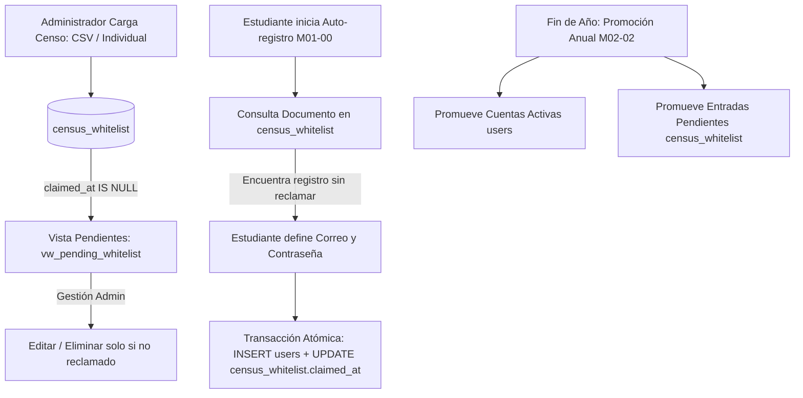

# Documentación Técnica — Módulo Censo y Lista Blanca (RF-M02, v2.8)

## 1. Resumen Ejecutivo y Objetivo de la Versión 2.8

En la versión **v2.8** de Wahl Mirai, el módulo de **Censo Electoral** migra su modelo de aprovisionamiento de cuentas. Anteriormente, la carga administrativa creaba directamente cuentas activas en la tabla `users` con contraseñas aleatorias generadas por el sistema.

A partir de esta versión, la carga administrativa (tanto individual como masiva por CSV) **únicamente registra estudiantes autorizados en la tabla `census_whitelist` (Lista Blanca)**. La creación de la cuenta de acceso (`users`), asignación de correo de contacto y definición de contraseña personal queda completamente delegada al **auto-registro del propio estudiante (Módulo M01-00)**.

---

## 2. Diagrama de Flujo del Ecosistema M02 / M01



---

## 3. Especificación de Componentes

### 3.1 Entidades y Tablas Principales

| Entidad / Tabla | Rol en el Sistema | Reglas Clave |
| :--- | :--- | :--- |
| `census_whitelist` | Almacena los estudiantes autorizados por la institución. | No es una cuenta de acceso. No tiene contraseña ni correo. |
| `users` (Voter) | Cuentas activas del sistema creadas tras el auto-registro. | Creadas exclusivamente por M01-00 o M09 (Admin). |
| `vw_pending_whitelist` | Vista SQL que expone entradas con `claimed_at IS NULL`. | Mapeada en EF Core como entidad de solo lectura `VwPendingWhitelist`. |
| `audit_log` | Registro inmutable de eventos de auditoría (RN-8). | Toda alta, baja, modificación, importación y promoción queda auditada. |

### 3.2 Formato de Plantilla CSV (`plantilla_censo_whitelist.csv`)

La carga masiva acepta archivos CSV codificados en UTF-8 con la siguiente estructura de cabecera:

```csv
documento,nombre,grado_id,excluir_promocion
1020304050,Juan Pérez,1,0
1020304051,María Gómez,2,0
1020304052,Carlos Rodríguez,3,1
```

- **`documento`**: Cadena numérica que identifica al estudiante. Se calcula su SHA-256 (`document_hash`) para búsquedas y se cifra en AES-256 (`encrypted_document`).
- **`nombre`**: Nombre completo del estudiante (letras, espacios y apóstrofes).
- **`grado_id`**: Identificador o nombre del grado escolar (1=6°, 2=7°, 3=8°, 4=9°, 5=10°, 6=11°).
- **`excluir_promocion`**: `1` si es repitente (se mantendrá en su grado en la promoción anual) o `0` si es promovible.

---

## 4. Promoción Anual Consolidada (M02-02)

La promoción anual de año lectivo (`IPromotionService` / `PromotionService`) aplica un avance de grado dual y coordinado:

1. **Usuarios Activos (`users` con estado ACTIVO):**
   - Si `excluir_de_promocion == 1`: Permanece en el grado actual y se reinicia la bandera a `0`.
   - Si está en último grado (`is_last_grade == 1`, ej. 11°): Pasa a estado `EGRESADO` y `grade_id = null`.
   - En caso normal: Avanza al grado con el siguiente `sequence_order`.
2. **Entradas Pendientes de Lista Blanca (`census_whitelist` con `claimed_at IS NULL`):**
   - Si `excluir_de_promocion == 1`: Permanece en el grado y se reinicia la bandera a `0`.
   - Si está en último grado: Se marca como `excluir_de_promocion = 1` (excluido de futuras promociones).
   - En caso normal: Actualiza su `grade_id` al siguiente grado en la secuencia escolar.
3. **Bloqueo y Forzado:**
   - La promoción se bloquea para evitar doble ejecución en el mismo año lectivo (`academic_years.promotion_executed_at`), requiriendo confirmación explícita (`force=true`) si se desea repetir.

---

## 5. Paginación Server-Side y Rendimiento

- Se implementó la clase genérica `PagedResult<T>` que encapsula `Items`, `TotalCount`, `PageNumber`, `PageSize`, `TotalPages`, `HasPreviousPage`, `HasNextPage`.
- Las consultas en `ICensusService` (`GetVotersPagedAsync` y `GetPendingWhitelistPagedAsync`) ejecutan filtros a nivel SQL en EF Core (`IQueryable`), ejecutan `CountAsync()` y aplican `.Skip().Take()` antes de descifrar registros en memoria.
- La carga masiva CSV carga previamente los hashes existentes en `HashSet<string>` para garantizar una inserción rápida de más de 2000 registros en menos de 5 segundos.

---

## 6. Auditoría y Trazabilidad (RN-8)

Todas las operaciones del módulo quedan asentadas en `audit_log`:

| Acción | Entidad | Descripción |
| :--- | :--- | :--- |
| `WHITELIST_ENTRY_CREATED` | `census_whitelist` | Alta individual de estudiante en lista blanca. |
| `WHITELIST_ENTRY_UPDATED` | `census_whitelist` | Modificación de nombre/grado/repitente en lista blanca. |
| `WHITELIST_ENTRY_DELETED` | `census_whitelist` | Eliminación de entrada pendiente en lista blanca. |
| `CSV_IMPORT_WHITELIST` | `census_whitelist` | Resumen de carga masiva CSV (procesados, insertados, duplicados, errores). |
| `PROMOTION_RUN` | `academic_years` | Registro del proceso de promoción con detalle JSON de promovidos, egresados y retenidos tanto de cuentas activas como de lista blanca. |
